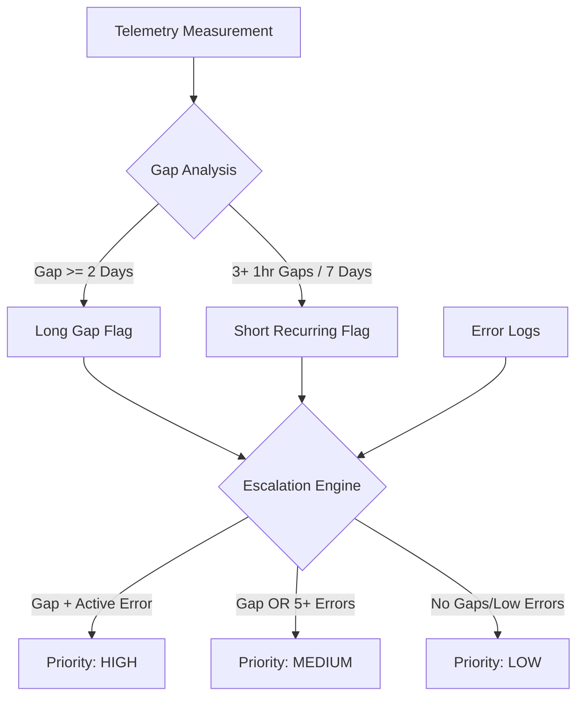

# IoT Telemetry & Solution Monitoring Analysis

## Project Overview
This project provides a comprehensive SQL-based analysis of IoT device telemetry to identify connectivity gaps, firmware performance issues, and hardware errors. The solution is optimized for **DuckDB** and processes three primary datasets: device metadata, telemetry measurements, and error logs.

---

## Technical Solution Overview (`iot_solution.sql`)
The final SQL solution is structured to handle massive telemetry datasets (including the 887 MB measurements file) efficiently using DuckDB's columnar engine.

### Key Analysis Sections:
1.  **Data Profiling**: Establishes baselines for data integrity, time horizons, and median ping intervals.
2.  **Gap Analysis**:
    *   **Long Gaps**: Silence period $\ge$ 2 days + 5 minutes (indicates power loss or total failure).
    *   **Short Recurring Gaps**: 3+ gaps of $\ge$ 1 hour within a rolling 7-day window (indicates "flaky" connectivity).
3.  **Lift Analysis**: Measures the concentration of error logs in problematic vs. healthy devices. **Finding**: Problematic devices show a **1.89x error lift** compared to the healthy fleet.
4.  **Escalation Logic**: Categorizes device health into High, Medium, and Low priority tiers.

---

## Integrated Logic & Visualizations

### 1. Escalation Logic (Process Flow)


### 2. Built-in SQL Charts
The script generates ASCII visualizations directly in the terminal to show:
*   **Error Frequency Bar Chart**: Identifies `MissingData.Status` as the top error.
*   **Escalation Priority Distribution**: Visualizes the volume of devices in each tier.

---

## Analysis Methodology & Findings

### Hypotheses for Intermittent Behavior
*   **Firmware `v2.3.1` Network Stack**: High correlation between connectivity gaps and `MissingData` errors in this firmware version suggests a memory leak or network driver crash.
*   **Regional Thermal Throttling**: Devices in high-heat regions (south) show recurring gaps that may be related to hardware-level thermal protection.
*   **Cellular Handoff Failures**: Intermittent behavior in cellular devices points to potential tower-switching issues or modem "stuck" states.

### Missing Data for Deeper Insights
*   **RSSI/SNR (Signal Strength)**: Crucial for distinguishing between "Offline" (power issue) and "Unreachable" (network issue).
*   **Internal Temperature Sensors**: To correlate environmental heat with hardware resets.
*   **Reboot Reason Codes**: To identify if devices are restarting due to a `Watchdog Timer` (crash) or manual power cycling.

---

## How to Run
1. Ensure `DuckDB` is installed (available via `pip install duckdb-cli`).
2. Run the script:
   ```bash
   duckdb -c ".read iot_solution.sql"
   ```
3. The script will automatically generate the profiling report, lift analysis, and the final `escalation_list` view.
