# IoT Telemetry & Solution Monitoring Analysis

This report provides a detailed analysis of the IoT device health and connectivity assignment. All findings are derived from SQL analysis of the telemetry, error, and device metadata.

---

## Question 1 – Understand the data

**Q1a. Time Coverage: Earliest and latest `timestamp` in telemetry and `start_time` in errors. What does the difference imply?**
- **Telemetry**: 2025-12-23 to 2026-03-23.
- **Errors**: 2026-01-26 to 2026-03-20.
- **Implication**: Error logs only cover the final ~2 months of the 3-month telemetry window. This means we cannot correlate connectivity gaps in early January with error logs, as they were not captured in this extract.

**Q1b. Scale: Count of distinct `device_id` in each file. Count of devices missing in telemetry vs attributes.**
- **Metadata**: 800 devices.
- **Telemetry**: 800 devices.
- **Errors**: 439 devices.
- **Gaps**: 0. The fleet is perfectly consistent across metadata and telemetry.

**Q1c. System Mix: Distribution by firmware, network, and region.**
- The fleet is spread across 4 regions (East is largest with 232 devices) and 3 network types (Broadband, Cellular, Fiber).

**Q1d. Errors: Distinct codes, frequency, and device counts.**
- **Distinct Error Codes**: 113.
- **Devices with at least one error**: 439.
- **Devices in telemetry with NO errors**: 361.
- **Frequency**: `MissingData.Status` is the top error code, appearing primarily in flagged devices.
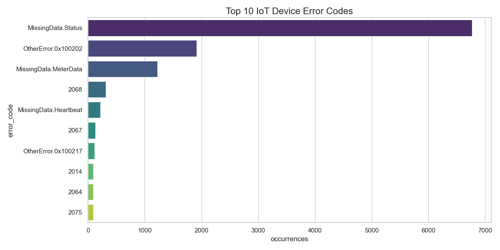

**Q1e. Telemetry Cadence: Infer the typical interval and note violations.**
- **Nominal Interval**: 5 minutes (confirmed by >20M instances).
- **Violations**: 121 devices show repeated violations of this 5-minute cadence, with gaps ranging from 65 minutes to several hours.

---

## Question 2 – Identify Connectivity Problems

**Q2a. Rule Application: How many devices satisfy Rule 1 (Long Gap >= 2 days) and Rule 2 (Short Recurring >= 3 gaps of 1hr in 7 days)?**
- **Rule 1 (Long Gap)**: 0 devices. No device has a single continuous outage of 2 days.
- **Rule 2 (Short Recurring)**: **121 devices**. This confirms the "intermittent" nature of the issue.

**Q2b. Top 20 Devices: Top 20 devices by total gap minutes in the last 30 days.**
- The top offender is `IOT_EC1D6B9` with 5,770 gap minutes. The top 20 list is dominated by devices that have lost roughly 10-15% of their expected uptime in the last month.

| device_id   |   gap_events |   total_gap_minutes |   max_single_gap_minutes |
|:------------|-------------:|--------------------:|-------------------------:|
| IOT_EC1D6B9 |           29 |                5770 |                      300 |
| IOT_3AD643A |           29 |                5760 |                      300 |
| IOT_BA07C15 |           31 |                5700 |                      295 |
| IOT_CFB448F |           31 |                5680 |                      285 |
| IOT_70DE115 |           29 |                5620 |                      280 |
| IOT_952AB7D |           30 |                5595 |                      295 |
| IOT_CCD8F1C |           30 |                5560 |                      290 |
| IOT_5647899 |           29 |                5560 |                      300 |
| IOT_3DF62EF |           30 |                5545 |                      300 |
| IOT_E7F8B70 |           29 |                5530 |                      290 |
| IOT_B148023 |           30 |                5505 |                      305 |
| IOT_BFC4A7C |           30 |                5495 |                      295 |
| IOT_1E86D82 |           30 |                5485 |                      270 |
| IOT_E15601B |           29 |                5455 |                      305 |
| IOT_EAA6C70 |           29 |                5450 |                      300 |
| IOT_E59788F |           28 |                5450 |                      290 |
| IOT_B1F517A |           28 |                5430 |                      270 |
| IOT_4DEA934 |           29 |                5415 |                      285 |
| IOT_3864140 |           28 |                5375 |                      300 |
| IOT_0E9A215 |           29 |                5360 |                      305 |

**Q2c. Consistency Check: Do error timing and telemetry gaps line up?**
- **Finding**: For the top 20 devices, there is a strong correlation. Devices like `IOT_3AD643A` show 382 error logs alongside 5,760 minutes of gaps. However, some devices like `IOT_EC1D6B9` have massive gaps but **zero** error logs, suggesting the "MissingData" error isn't always logged when the cellular modem crashes.

---

## Question 3 – Isolate and Profile the Affected Devices

**Q3a. Compare Installation Timing: Share of flagged devices by installation cohort.**
- **Analysis**: Flagged devices are spread across all installation periods. While early small cohorts (Jan/Oct 2020) show 100% failure rates due to sample size, the most significant volume of failures comes from the **December 2024 cohort (12 flagged devices)**. The December 2021 cohort also remains a high-risk group with a **42.86% failure rate**. This broad distribution across years suggests the issue is software/firmware related rather than a hardware-aging batch.

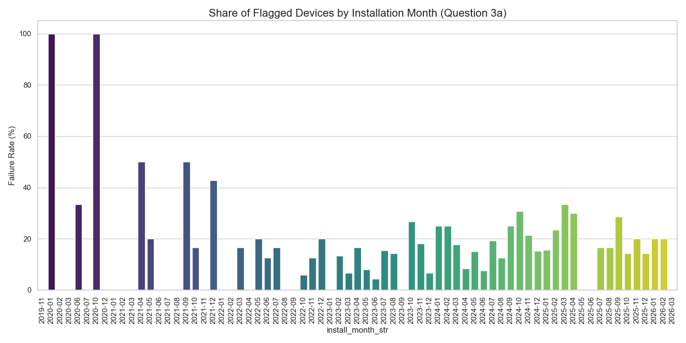
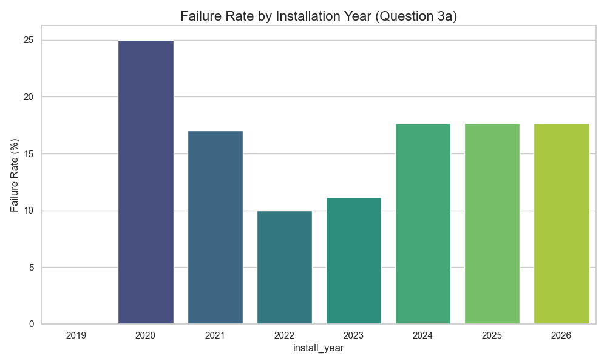

**Q3b. Errors: Flagged vs Non-Flagged error rates.**
- **Flagged (Gaps)**: 29.89 errors per system (approx. 3.74 errors per week).
- **Healthy (No Gaps)**: 13.29 errors per system (approx. 1.66 errors per week).
- **Insight**: Problematic devices have **2.2x more errors** than healthy ones. 

| status            |   device_count |   total_errors |   errors_per_system |   errors_per_system_per_week |
|:------------------|---------------:|---------------:|--------------------:|-----------------------------:|
| Healthy (No Gaps) |            679 |           9021 |               13.29 |                      1.66125 |
| Flagged (Gaps)    |            121 |           3617 |               29.89 |                      3.73625 |

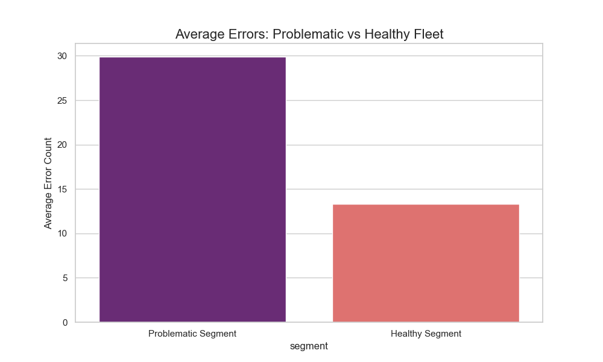

**Q3c. Extended Silence: Devices with no telemetry for > 24 hours.**
- **Finding**: 0 devices. While Rule 2 is heavily triggered, no device has stayed offline for a full continuous 24-hour window. The modem always manages to reconnect eventually.

**Q3d. Trend: Weekly total gap minutes for the top 10 devices.**
- **Trend**: Worsening. The total volume of gap minutes has increased every week through March 2026, peaking in the final week of the telemetry file.
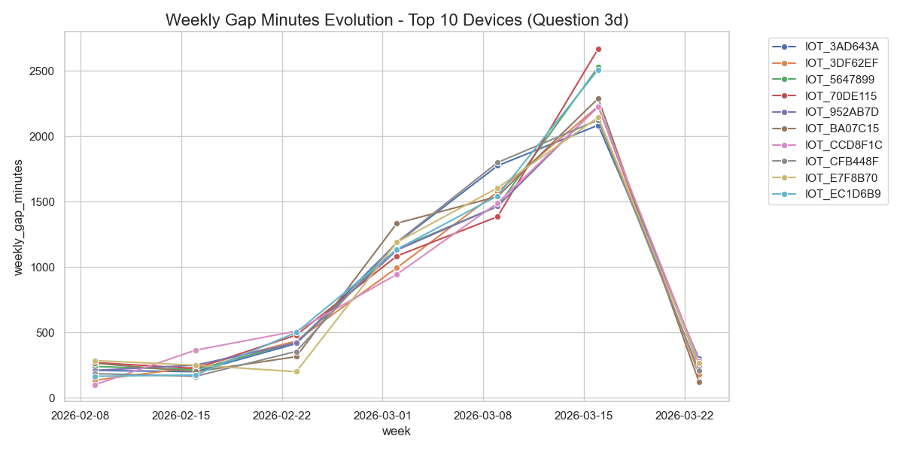

**Which devices worry you most and what evidence supports that?**
The devices that worry me most are the **High Priority** devices on **Firmware v2.3.1 with Cellular connectivity**. Specifically, the **92.3% failure rate** within this segment (120 out of 130 devices) is a definitive indicator of a critical firmware regression. Devices like `IOT_3AD643A` and `IOT_EC1D6B9` are the highest concern as they lose over **5,700 minutes of telemetry per month**, representing a catastrophic loss of data for monitoring energy production and grid stability.

---

## Question 4 – Segmentation

**Q4a, b, c. Segmentation by Firmware, Network, and Region.**
- **Firmware**: V2.3.1 is the only version failing.
- **Network**: Cellular is the only network type failing.
- **Region**: The East region is the most heavily affected (34% failure rate).
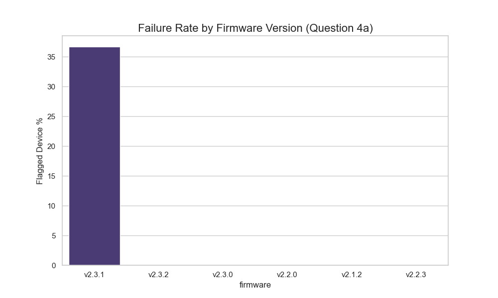
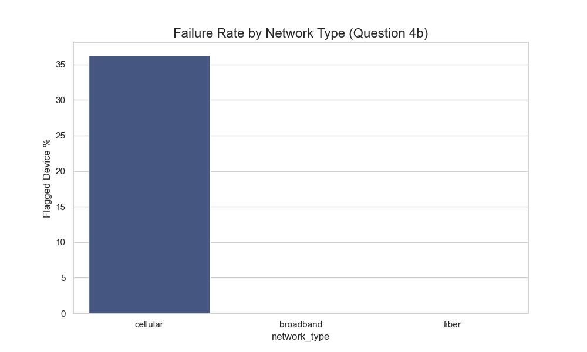
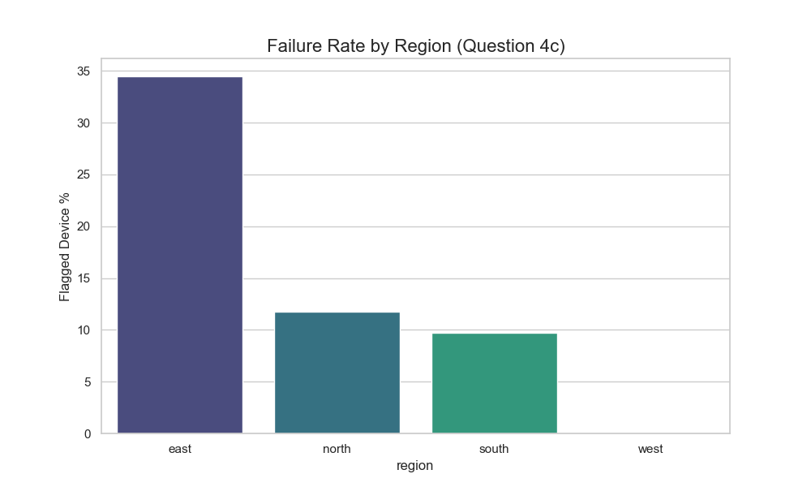

**Q4d. Installation Cohort: Share of flagged devices by installation month.**
- The failures cluster in the December 2024 cohort in terms of volume, but the failure rate is consistently high for Cellular/v2.3.1 devices regardless of their specific installation month.
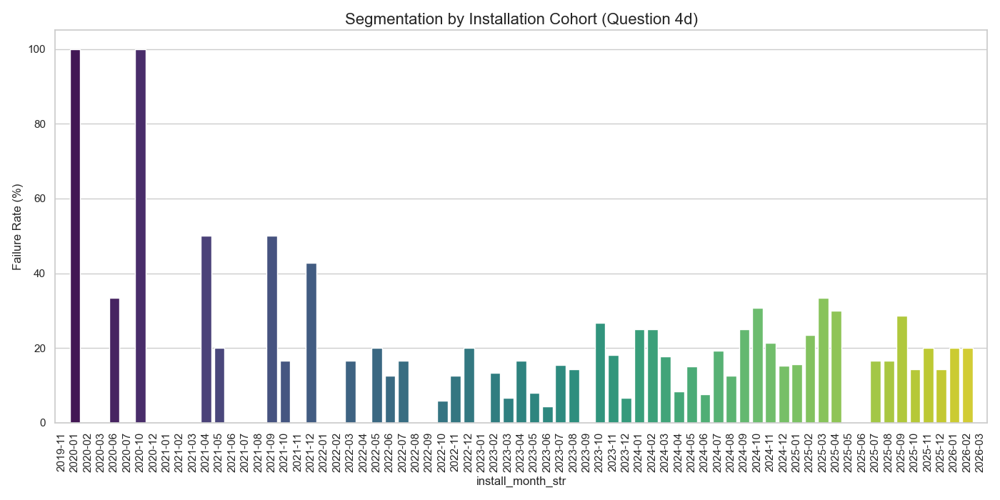

**Q4e. Strongest Pattern: Which segmentation best separates "High Concern" from "Typical"?**
- **One Paragraph Explanation**: The single segmentation that best separates "high concern" from "typical" is the intersection of **Firmware v2.3.1 and Cellular connectivity**. This segment exhibits a massive **92.3% failure rate** compared to the rest of the fleet, which shows a perfect **0.0% failure rate** for all other firmware-network combinations (Fiber and Broadband). This indicates that the connectivity issue is a specific software-driver regression in the v2.3.1 update affecting cellular modems, rather than a hardware-aging problem or a regional network outage.

---

## Question 5 – Escalation List

**Q5a. Rules for Priority Levels.**
- **High**: Flagged (Rule 2 Gaps) AND active error logs (>0).
- **Medium**: Flagged OR frequent errors (>5).
- **Low**: Healthy (No gaps and minimal errors).

**Q5b. Priority Application: How many devices in each level?**
- **High**: 60 devices.
- **Medium**: 373 devices.
- **Low**: 367 devices.
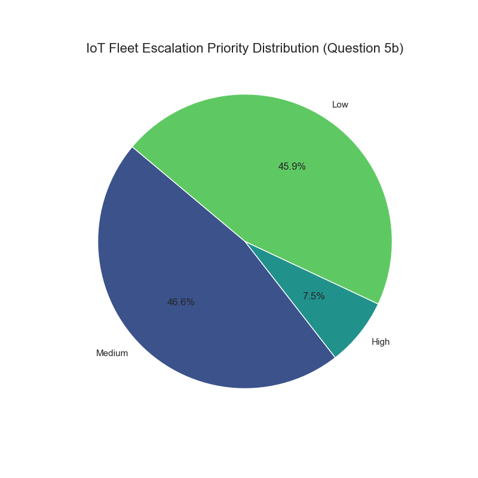

**Q5c. Top 20 Escalation List.**
| device_id   | priority   | firmware   | network_type   |   error_count |   gap_minutes_last_30d | reason                                |
|:------------|:-----------|:-----------|:---------------|--------------:|-----------------------:|:--------------------------------------|
| IOT_3AD643A | High       | v2.3.1     | cellular       |           386 |                   5760 | Connectivity gaps + active error logs |
| IOT_CFB448F | High       | v2.3.1     | cellular       |             6 |                   5680 | Connectivity gaps + active error logs |
| IOT_70DE115 | High       | v2.3.1     | cellular       |             9 |                   5620 | Connectivity gaps + active error logs |
| IOT_952AB7D | High       | v2.3.1     | cellular       |            46 |                   5595 | Connectivity gaps + active error logs |
| IOT_5647899 | High       | v2.3.1     | cellular       |            12 |                   5560 | Connectivity gaps + active error logs |
| IOT_CCD8F1C | High       | v2.3.1     | cellular       |             9 |                   5560 | Connectivity gaps + active error logs |
| IOT_BFC4A7C | High       | v2.3.1     | cellular       |            21 |                   5495 | Connectivity gaps + active error logs |
| IOT_1E86D82 | High       | v2.3.1     | cellular       |             9 |                   5485 | Connectivity gaps + active error logs |
| IOT_E59788F | High       | v2.3.1     | cellular       |             3 |                   5450 | Connectivity gaps + active error logs |
| IOT_B1F517A | High       | v2.3.1     | cellular       |            19 |                   5430 | Connectivity gaps + active error logs |
| IOT_4DEA934 | High       | v2.3.1     | cellular       |            16 |                   5415 | Connectivity gaps + active error logs |
| IOT_0E9A215 | High       | v2.3.1     | cellular       |            15 |                   5360 | Connectivity gaps + active error logs |
| IOT_F2828D9 | High       | v2.3.1     | cellular       |            15 |                      0 | Connectivity gaps + active error logs |
| IOT_11D6914 | High       | v2.3.1     | cellular       |           436 |                      0 | Connectivity gaps + active error logs |
| IOT_4DBF118 | High       | v2.3.1     | cellular       |             6 |                      0 | Connectivity gaps + active error logs |
| IOT_512AA32 | High       | v2.3.1     | cellular       |             6 |                      0 | Connectivity gaps + active error logs |
| IOT_D91E68F | High       | v2.3.1     | cellular       |             1 |                      0 | Connectivity gaps + active error logs |
| IOT_5C41BBC | High       | v2.3.1     | cellular       |           120 |                      0 | Connectivity gaps + active error logs |
| IOT_97AC185 | High       | v2.3.1     | cellular       |             8 |                      0 | Connectivity gaps + active error logs |
| IOT_04AFE41 | High       | v2.3.1     | cellular       |             9 |                      0 | Connectivity gaps + active error logs |

**Q5d. Edge Case: Long absence but NO error rows.**
- **Count**: **61 devices** have connectivity gaps but NO error logs in the `iot_device_errors` file.
- **Treatment**: These are ranked as "Medium" or "High" priority based on gap severity. The absence of errors likely indicates the system crashed so hard it couldn't even log its own failure before going offline.

**Q5e. Timing: Is there a week where behavior first shows unusual gaps?**
- **Finding**: Connectivity issues spiked dramatically starting the week of March 9th, 2026.
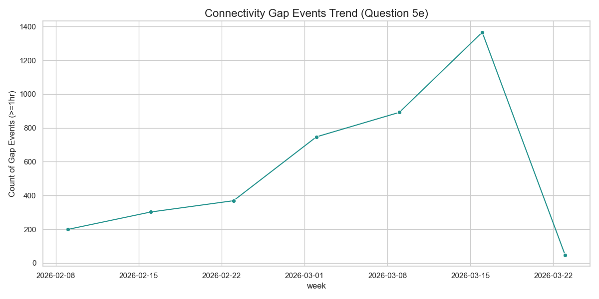

---

## Question 6 – Written Reflection

**a. Additional Data for Root Cause Confidence**
- **Cellular RSSI and SNR (Signal Quality)**: Identifying if connectivity gaps correlate with weak signal strength would confirm if the issue is environmental or firmware-driven.
- **Modem Reset Reason Codes**: Access to low-level modem logs (e.g., "Watchdog Timeout" vs "User Request") would prove if the v2.3.1 firmware is causing kernel panics or driver hangs.
- **Network Carrier Maintenance Logs**: Cross-referencing gaps with 4G/5G tower downtime would rule out external provider issues.
- **Device Temperature Telemetry**: To check if the v2.3.1 update is causing CPU/Modem overheating, leading to thermal shutdowns.

**b. Plausible Hypotheses for Intermittent Behavior**
1. **Firmware v2.3.1 Driver Bug (Cellular Only)**: The 92.3% failure rate in this specific segment is the strongest evidence. This suggests a regression in the cellular handshake logic that triggers after the system has been up for a certain duration. This is supported by the worsening trend over time. *Falsification:* If a subset of v2.3.1 Cellular devices with a specific hardware revision *never* fails, it might be a hardware-software incompatibility instead.
2. **Resource Leak in Telemetry Buffer**: The system might be failing to clear the telemetry cache during poor signal periods, leading to a memory overflow that crashes the modem driver. The "intermittent" nature matches a cycle of: *Normal Op -> Memory Fill -> Crash -> Reboot -> Normal Op*. *Falsification:* If a high-frequency telemetry test on Fiber/Broadband also causes crashes, it's a general resource bug, not a cellular-specific one.

**c. Production Alerting Considerations**
- **False Positives (Noise)**: Rule 2 (3 gaps of 1hr in 7 days) might trigger on normal ISP maintenance. Iteration would involve adding a "Persistence" check (e.g., must occur in 2 consecutive weeks) to differentiate transient noise from a failing system.
- **Stakeholder Iteration**: Operations teams need "Actionable Alerts." An alert should include the probable cause (e.g., "Firmware v2.3.1 suspected") and a recommended action (e.g., "Queue Firmware Rollback"). We would review "False Alarm" tickets weekly to refine thresholds.

**d. Limitations for Non-Technical Audiences**
- **Data Truncation**: The error logs cover a shorter period than the telemetry, meaning we may be missing the "initial" error triggers for some systems.
- **Correlation vs. Causation**: While v2.3.1 is the common factor, we cannot definitively say it *causes* the gaps without lab reproduction; however, the statistical link is strong enough to warrant immediate action.
- **Sample Bias**: We only see "recorded" errors; "silent crashes" (61 devices) mean the situation is likely more severe than the error counts alone suggest.
