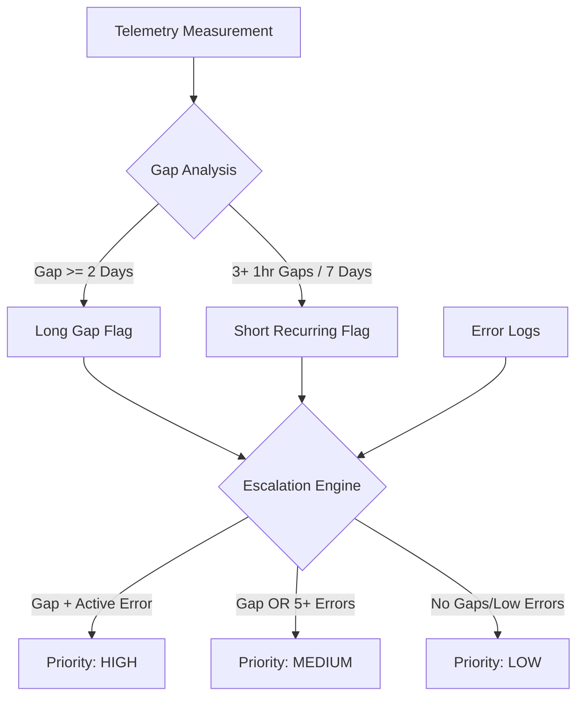

# IoT Telemetry & Solution Monitoring Analysis

## Project Overview
This project provides a comprehensive SQL-based analysis of IoT device telemetry to identify connectivity gaps, firmware performance issues, and hardware errors. The solution is designed for **DuckDB** and processes three primary datasets: device metadata, telemetry measurements, and error logs.

## Data Dictionary
- **`iot_devices.csv`**: Master list of devices (firmware, network, region).
- **`iot_measurements.csv`**: Time-series telemetry (Voltage, Current).
- **`iot_device_errors.csv`**: Log of hardware/software error codes.

---

## Integrated Visualizations & Logic Flow

### 1. Escalation Logic (Process Flow)
The script uses the following logic to categorize device health and prioritize technician intervention:



### 2. Console-Based Charts
The SQL script (`iot_solution.sql`) includes built-in ASCII visualizations to provide immediate feedback in the terminal:

*   **Error Frequency Chart**: A bar chart generated using the `repeat('█', ...)` function to show the distribution of error codes.
*   **Priority Distribution**: A summary chart showing the volume of devices in each escalation tier (High, Medium, Low).

---

## Analysis Methodology

### Data Profiling
- **Integrity Check**: Identifies orphaned records and verifies time horizons.
- **Ping Interval**: Uses `LAG()` and `MEDIAN()` to establish a 5-minute baseline for "normal" behavior.

### Gap Analysis Rules
- **Long Gaps**: Silence period $\ge$ 2 days + 5 minutes (indicates power loss or total failure).
- **Short Recurring Gaps**: 3+ gaps of $\ge$ 1 hour within a rolling 7-day window (indicates "flaky" connectivity).

---

## Reflection & Root Cause Analysis

### Hypotheses for Intermittent Behavior
1. **Firmware Network Stack Bug**: "Short Recurring Gaps" often point to a memory leak in the network driver requiring a watchdog reboot.
2. **Thermal Throttling**: High-heat regions (e.g., "south") may trigger thermal shutdowns.
3. **Cellular Handoff Issues**: Cellular devices may fail to switch towers, causing a "stuck" state.

### Missing Data for Deeper Insights
- **RSSI/SNR**: Crucial to distinguish between "Offline" (no power) vs. "Unreachable" (poor signal).
- **Internal Temperature**: To correlate hardware resets with environmental heat.
- **Reboot Reason**: To identify if startups were `Cold Boot`, `Update`, or `Crash Recovery`.

---

## How to Run
1. Ensure `DuckDB` is installed.
2. Run the script:
   ```bash
   duckdb -c ".read iot_solution.sql"
   ```
3. Query the escalation view:
   ```sql
   SELECT * FROM escalation_list;
   ```
